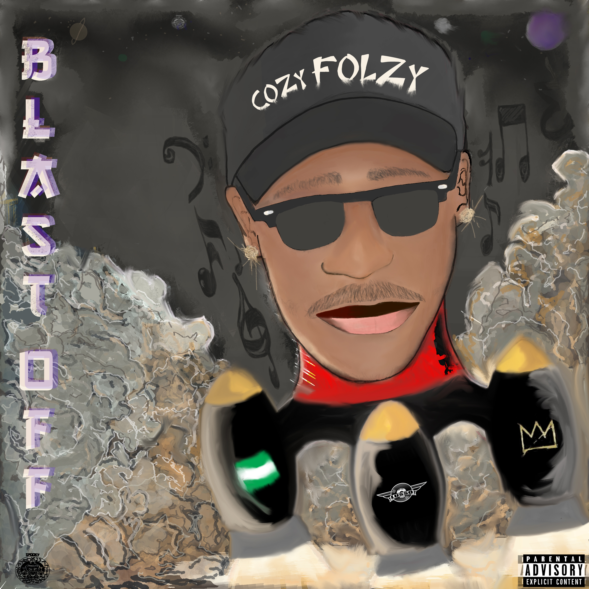

<head>
  <!-- Favicon -->
  <link rel="shortcut icon" href="../../favicon.ico">
  <!-- Global site tag (gtag.js) - Google Analytics -->
  
  
</head>

<!-- Main Links -->
#### [Home](../../README.md) | [Blog](../../blog/main.md) | [Archives](../../archives.md) | [Music](../main.md) | [Art](../../art/main.md) | [Contributors](../../contributors.md) | [Upload](../../upload.md)

- - -

## [Music](../main.md)

- - -
- - -

## [Blast-Off (The EP)](#)	

   

Jason Odianosen Folarin Ibadin, popularly known as Cozy Folzy is a Rap Artist from / born in Lagos, Nigeria.  

Folzy started writing his own rhymes and rapping since he was 7 years old. He grew up listening to 50 Cent, Jay Z, Kanye West, Lil Wayne, Drake, Naeto C, MI Abaga and A$AP Rocky.  

As Folzy got older and smarter, he studied the rap game and decided to take Hip Hop / Rap more seriously while he was living Toronto, Canada.   

Cozy Folzy moved to London, England for studies and he decided to also use the opportunity to start recording music professionally in 2013.  

"The Cozy One" as he is called by close friends started getting features by up coming & established artists once they noticed the lyrical skill and supreme self confidence that Folzy has in his system.  

Folzy linked up with Trick Beats, a popular beat producer and sound engineer in Coventry, England where he started recording professionally at Trick Beats Studio.  

In 2015, Trick Beats Introduced Folzy to one of the coolest rising artist in England, Nigerian Born Twizzy and Cozy Folzy was the only Artist Featured on Twizzy's EP "Some Dope EP". They made a hit record titled F.M.N which was widely appreciated by listeners all over the world.  

Folzy moved back to Nigeria with the aim of taking over the rap industry, not only in Nigeria but in Africa as a whole. He met with another popular Artist In Nigeria with the same goal named Skinny Jiggy.   

They teamed up with Jam City Live, an Established Music and Entertainment Company where they started making records while Jam City Live played a major role in the movement.  

Folzy was featured on Skinny Jiggy's GANG as well as Wedesday Night Vibes which turned out to be a well received record while GANG became an Anthem for the fans and supporters. Both records were on Jiggy's mixtape titled Palm Trees & Lean.  

Cozy Folzy got more serious with the music as his major love for Rap grew and expanded.  

As his major love for Rap grew and expanded, he started his own Record Label (Lusso Records) in 2018.  

According to him he relesed "one of the best rap projects in Nigeria" titled "BLAST-OFF" in November 2018. The songs were recorded and engineered by Nyesco Mic at GberaTinrin Studios, in Ibadan.  

Blast-Off is currently available on SoundCloud and is getting multiple plays everyday as the fans keep enjoying the coziness.   

Folzy has more plans for his future. His First mixtape would be released in 2019 and more great things would come after that.    

- - -

 

### DOWNLOAD SONGS BELOW

* <a href="https://poetrique.github.io/music-repo/eps_albums_mixtapes/cozy-folzy_blast-off_EP/01_Better-Things.mp3" download="Cozy-Folzy_01_Better-Things">01: Better Things</a>  
* <a href="https://poetrique.github.io/music-repo/eps_albums_mixtapes/cozy-folzy_blast-off_EP/02_Devil-May-Care.mp3" download="Cozy-Folzy_02_Devil-May-Care">02: Devil May Care</a>  
* <a href="https://poetrique.github.io/music-repo/eps_albums_mixtapes/cozy-folzy_blast-off_EP/03_Pandemonium.mp3" download="Cozy-Folzy_03_Pandemonium">03: Pandemonium</a>  
* <a href="https://poetrique.github.io/music-repo/eps_albums_mixtapes/cozy-folzy_blast-off_EP/04_Mafioso.mp3" download="Cozy-Folzy_04_Mafioso">04: Mafioso</a>  
* <a href="https://poetrique.github.io/music-repo/eps_albums_mixtapes/cozy-folzy_blast-off_EP/05_Triple-Threat.mp3" download="Cozy-Folzy_05_Triple-Threat">05: Triple Threat</a>   
* <a href="https://poetrique.github.io/music-repo/eps_albums_mixtapes/cozy-folzy_blast-off_EP/06_Straight-Barz.mp3" download="Cozy-Folzy_06_Straight-Barz">06: Straight Barz</a>  
* <a href="https://poetrique.github.io/music-repo/eps_albums_mixtapes/cozy-folzy_blast-off_EP/07_Blue-Bandz.mp3" download="Cozy-Folzy_07_Blue-Bandz">07: Blue Bandz</a>  
* <a href="https://poetrique.github.io/music-repo/eps_albums_mixtapes/cozy-folzy_blast-off_EP/08_Money-Talk.mp3" download="Cozy-Folzy_08_Money-Talk">08: Money Talk</a> 

- - -

For bookings and inquiries :  

<a href="callto:+2348032900743" alt="+2348032900743"><b>+2348032900743</b></a> `|` [**cozybookings@jamcitylive.com**](#) `|` [@cozyfolzy](https://instagram.com/cozyfolzy)  