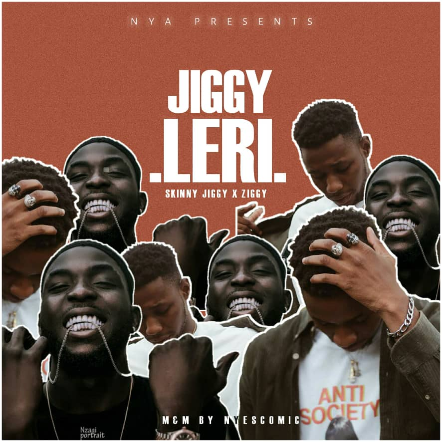
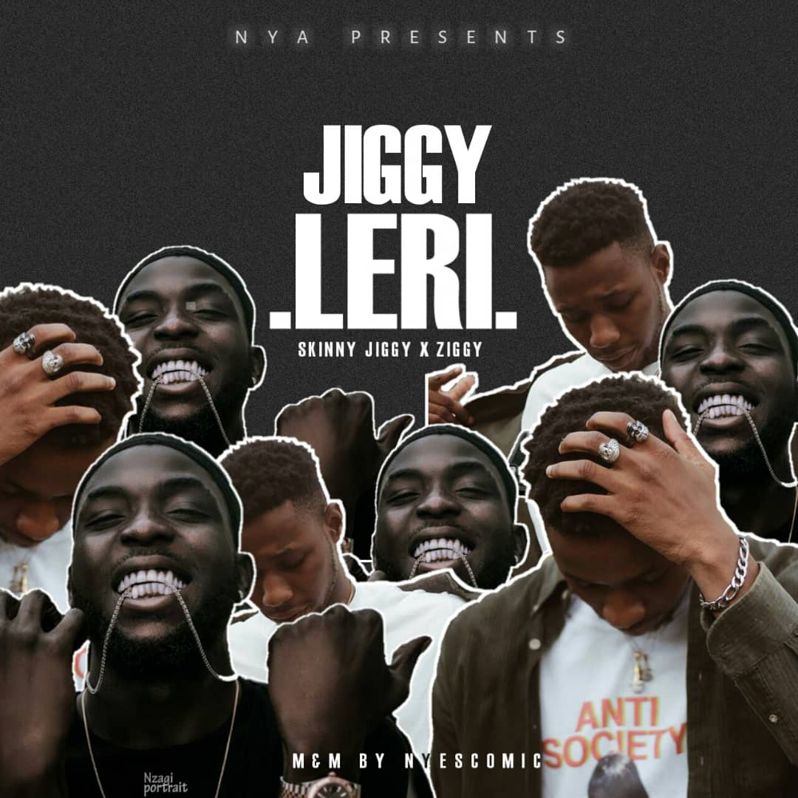

<head>
  <!-- Favicon -->
  <link rel="shortcut icon" href="../../favicon.ico">
  <!-- Global site tag (gtag.js) - Google Analytics -->
  
  
</head>

<!-- Main Links -->
#### [Home](../../index.md) | [Blog](../../blog/index.md) | [Music](../index.md) | [Art](../../art/index.md) | [Contributors](../../contributors.md) | [Upload](../../upload.md)

- - -

## [Music](../index.md)

- - -
- - -

## [Skinny Jiggy - JIGGYLERI ft. Ziggy](#)	

  

This song is a complete tune. From the powerhouse that is Lead City University, two of the biggest musical arts collaborate to bring you a track, that certifies 2019 as **dope**, **wavy** & more than **trippy**.  

A track by Skinny Jiggy the original Gambino, and Ziggy the lowkey hustler.  

  

Download and bless your eardrums!

#### <a href="https://poetrique.github.io/music-repo/singles/xyz/SkinnyJiggy_JIGGYLERI-ft-Ziggy.mp3" download="SkinnyJiggy_JIGGYLERI-ft-Ziggy">DOWNLOAD >> Skinny Jiggy - JIGGYLERI ft. Ziggy</a>

- - -

* [Back Home](../index.md)