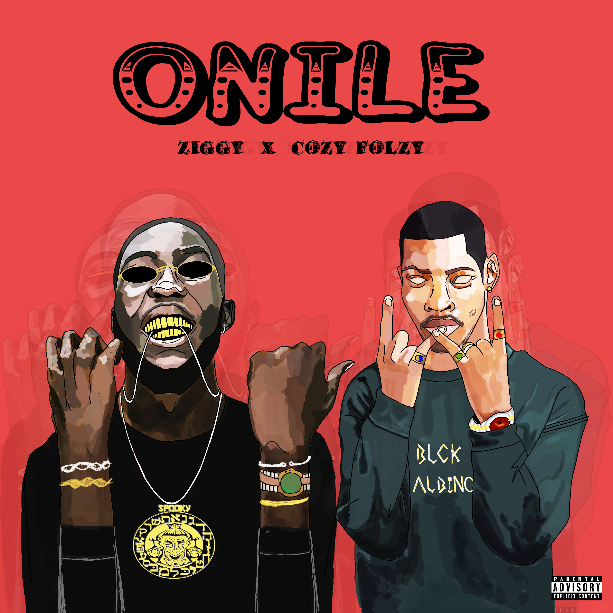

<head>
  <!-- Favicon -->
  <link rel="shortcut icon" href="../../favicon.ico">
  <!-- Global site tag (gtag.js) - Google Analytics -->
  
  
</head>

<!-- Main Links -->
#### [Home](../../index.md) | [Blog](../../blog/index.md) | [Music](../index.md) | [Art](../../art/index.md) | [Contributors](../../contributors.md) | [Upload](../../upload.md)

- - -

## [Music](../index.md)

- - -
- - -

## [Ziggy - ONILE ft. Folzy](#)	

- - -

* [Back Home](../index.md)
